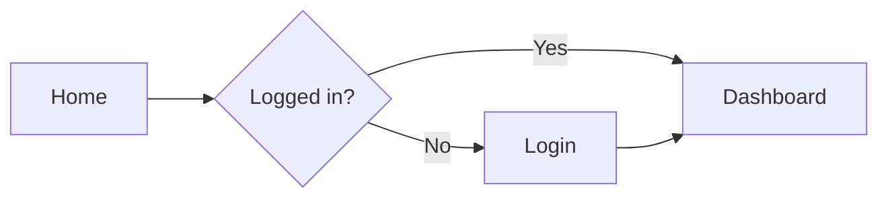

# UX Flow Diagram

A skill that visualizes user flows and screen transitions—**ASCII** (below) or **Mermaid** (rendered in GitHub / many editors).

## When **not** to diagram (save time)

- Problem statement or **primary user** is still **unknown** or disputed  
- You are still listing **hypotheses**—use bullets first, diagram after alignment  
- **Single linear screen** with no branches—paragraph or bullet list is enough  

## When to Use

- Documenting user journeys
- Designing navigation flows between screens
- Defining user flows per feature
- Representing conditional branching and exception handling flows

## Mermaid option (single standard)

When the user can render Mermaid (README, Notion, GitHub, many IDEs), prefer **one** diagram style for the whole doc:



Use `flowchart TD` for top-down layouts. Keep **≤ 12 nodes** per chart; split into linked subflows if larger.

## Flow Diagram Symbols

### Basic Nodes
```
┌─────────┐
│ Screen  │     ← Screen/Page
└─────────┘

╔═════════╗
║ Screen  ║     ← Start/End screen (emphasis)
╚═════════╝

((Action))      ← User action
<Decision?>     ← Condition/Branch point
[Process]       ← System process
```

### Connection Lines
```
───→     Unidirectional flow
←──→     Bidirectional flow
- - →    Optional/conditional flow
═══→     Main flow (emphasis)
```

## Flow Patterns

### Linear Flow (Sequential)
```
╔═══════════╗    ┌───────────┐    ╔═══════════╗
║   Start   ║───→│  Step 1   │───→║    End    ║
╚═══════════╝    └───────────┘    ╚═══════════╝
```

### Branching Flow
```
                         Yes  ┌───────────┐
                    ┌────────→│  Path A   │────┐
┌───────────┐       │         └───────────┘    │    ┌───────────┐
│  Screen   │───→<Decision?>                   ├───→│   Result  │
└───────────┘       │         ┌───────────┐    │    └───────────┘
                    └────────→│  Path B   │────┘
                         No   └───────────┘
```

## Constraints

- Flows progress left-to-right, top-to-bottom
- Complex flows should be split into sub-flows
- All branch points need clear condition labels